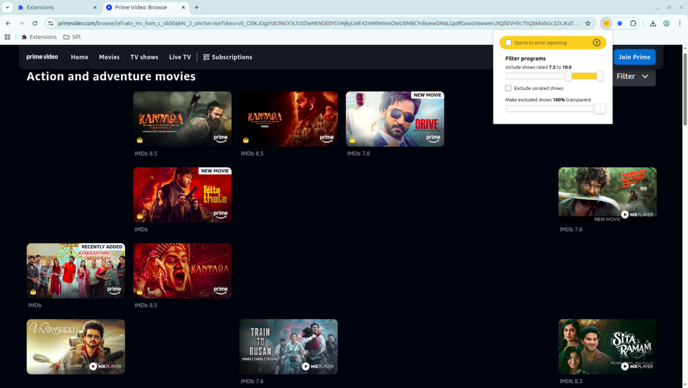

#  Sift

## What does this extension do? [20s Demo][demo-video-link]

- adds the IMDB rating of a movie / tv show next to it's tile on the page
- clicking on the rating opens the movie's IMDB page in a new tab
- requests permissions **only** for the sites you enable it on after installation
- allows you to "fade-to-black" programs that are low-rated

## Get it for

[][chrome-link] &nbsp; [][edge-link] &nbsp; [][firefox-link]

## Supported OTT platforms

See what platforms are supported [here][supported-platforms-link]

## Build instructions

- To build the extension:
  - `cd packages/extension && pnpm install`, then
    - `pnpm run build --target=chrome` for chrome
    - `pnpm run build --target=firefox` for firefox
    - `pnpm run build --target=edge` for edge
- Tested with node v24 and pnpm v10

## Misc

- Read the extension's [privacy policy][privacy-policy-link]

- Movie ratings are sourced from Brian Fritz's [OMDB API][omdbapi-link]; if you found this extension useful, consider donating via Brian's [Patreon][omdbapi-patreon-link]

[chrome-link]: https://chromewebstore.google.com/detail/sift-imdb-ratings-on-indi/pfnhkljamlclkackkndllofcfhihacna
[edge-link]: https://microsoftedge.microsoft.com/addons/detail/odgepppomekmdiifmjmocpjhopdmgjnl
[firefox-link]: https://addons.mozilla.org/firefox/addon/sift-imdb-ratings/
[omdbapi-link]: https://omdbapi.com
[omdbapi-patreon-link]: https://www.patreon.com/join/omdb
[demo-video-link]: https://youtu.be/0nacMtjRhk4
[github-link]: https://github.com/ackinc/webext-movie-ratings
[privacy-policy-link]: https://getsift.today/privacy
[supported-platforms-link]: https://getsift.today#platforms
